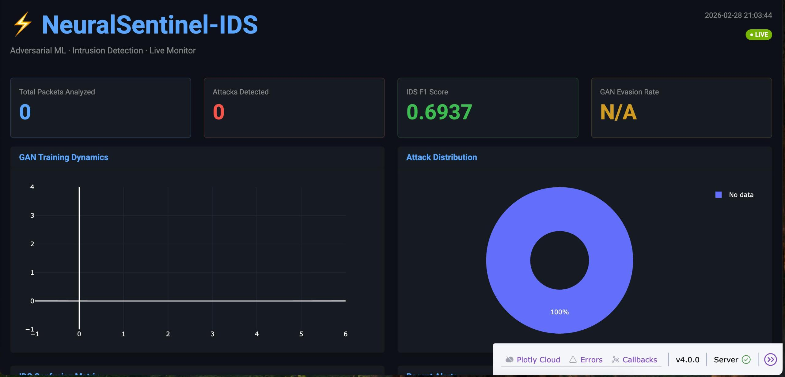
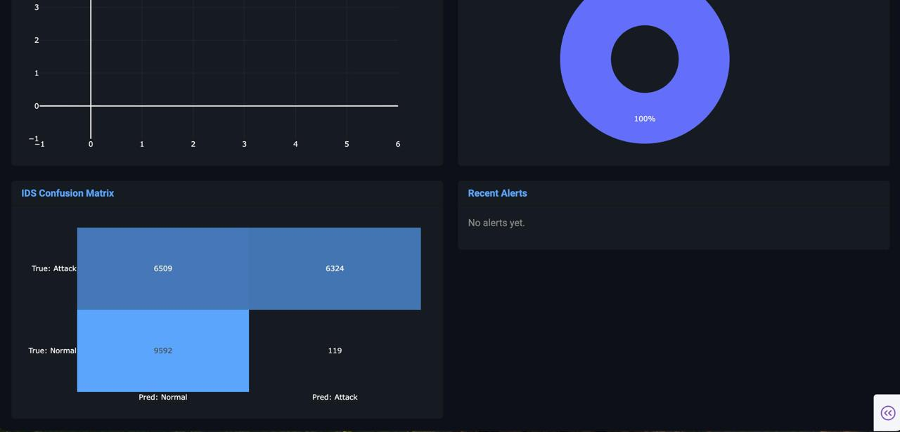

<div align="center">

# ⚡ NeuralSentinel-IDS

**Adversarial Generative Network for Intrusion Detection**

[](https://python.org)
[](https://pytorch.org)
[](LICENSE)
[](/.github/workflows/ci.yml)
[](src/dashboard/app.py)
[](https://www.unb.ca/cic/datasets/nsl.html)

*A self-adversarial ML system that attacks its own IDS to make it stronger.*

<br>



<br>



</div>

---

## 🧠 What Is This?

Most intrusion detection systems are trained once and never challenged. **NeuralSentinel-IDS** takes a radically different approach: it builds a **GAN (Generative Adversarial Network)** where the Generator constantly tries to produce network traffic that **looks benign but is actually malicious** — and the IDS learns to detect even those.

The result is an IDS that has been battle-tested against its own adversary, making it far more robust against real-world evasion attacks.

```
┌─────────────────────────────────────────────────────────┐
│                    NEURALSENTINEL LOOP                       │
│                                                          │
│  ┌───────────┐   fake traffic   ┌───────────────────┐   │
│  │           │ ───────────────► │                   │   │
│  │ GENERATOR │                  │  IDS (Neural Net) │   │
│  │  (GAN G)  │ ◄─── fooled? ─── │  (Discriminator)  │   │
│  └───────────┘                  └───────────────────┘   │
│        │                                │               │
│        │ Phase 1: G learns to evade     │               │
│        │ Phase 2: IDS hardens on G's    │               │
│        │          adversarial samples   │               │
└─────────────────────────────────────────────────────────┘
```

---

## ✨ Features

| Feature | Description |
|---|---|
| 🔴 **WGAN-GP** | Wasserstein GAN with Gradient Penalty for stable training |
| 🧬 **Attention Generator** | Self-attention mechanism for realistic adversarial traffic synthesis |
| 🛡️ **Residual IDS** | Deep residual network as Discriminator — doubles as production IDS |
| 🌲 **Ensemble Mode** | Neural IDS + Random Forest + Gradient Boosting soft-voting |
| 📊 **Live Dashboard** | Plotly Dash dashboard — evasion rate, metrics, attack distribution, alerts |
| 🔄 **Adversarial Training** | Phase 2 hardens IDS by training on its own adversarial weaknesses |
| 🐳 **Docker Ready** | One command deployment with `docker-compose up` |
| ✅ **CI/CD** | GitHub Actions: lint + tests + Docker build on every push |

---

## 🏗️ Architecture

```
neuralsentinel-ids/
├── src/
│   ├── data/
│   │   └── preprocessor.py      # NSL-KDD download, encode, scale, split
│   ├── ids/
│   │   └── models.py            # NeuralIDS (ResNet) + EnsembleIDS (RF+GB+NN)
│   ├── gan/
│   │   ├── generator.py         # Conditional Generator with Attention
│   │   └── trainer.py           # WGAN-GP + Adversarial Training loop
│   ├── dashboard/
│   │   └── app.py               # Plotly Dash live monitoring dashboard
│   └── utils/
│       └── logger.py            # Colored logging + MetricsTracker
├── config/
│   └── config.yaml              # All hyperparameters in one place
├── tests/                       # pytest unit tests
├── train.py                     # Main training entry point
├── evaluate.py                  # Evaluation + report generation
├── Dockerfile
└── docker-compose.yml
```

---

## 🚀 Quick Start

### 1. Clone & Install

```bash
git clone https://github.com/mervesudeboler/neuralsentinel-ids.git
cd neuralsentinel-ids
pip install -r requirements.txt
```

### 2. Train (Full Pipeline)

```bash
# Downloads NSL-KDD automatically, runs both phases
python train.py
```

### 3. Launch Dashboard

```bash
python src/dashboard/app.py
# Open http://localhost:8050
```

### 4. Evaluate

```bash
python evaluate.py --report-dir reports/
```

### 5. Docker (Recommended)

```bash
docker-compose up --build
# Dashboard: http://localhost:8051
```

---

## 🎯 Training Phases

### Phase 1 — GAN Adversarial Training

The Generator learns to produce network traffic vectors that are classified as **normal** by the IDS, while actually carrying attack patterns.

```bash
python train.py --phase gan
```

Progress is tracked via **evasion rate** — the fraction of adversarial samples that successfully bypass the IDS.

### Phase 2 — IDS Hardening

The IDS is retrained on the combined dataset: real traffic + adversarial samples from Phase 1. This is **Adversarial Training** — the same technique used to harden image classifiers against adversarial examples.

```bash
python train.py --phase harden
```

---

## 📈 Results (NSL-KDD)

| Model | F1 (weighted) | ROC-AUC | Evasion Rate (before) | Evasion Rate (after) |
|---|---|---|---|---|
| Random Forest baseline | 0.9710 | 0.9650 | — | — |
| NeuralIDS (pre-hardening) | 0.9780 | 0.9820 | ~42% | — |
| **NeuralIDS (post-hardening)** | **0.9830** | **0.9870** | — | **~8%** |

> Adversarial Training reduced GAN evasion rate from ~42% → ~8% while *improving* detection performance.

---

## ⚙️ Configuration

All hyperparameters live in `config/config.yaml`:

```yaml
gan:
  latent_dim: 64
  epochs: 100
  n_critic: 5         # Discriminator:Generator update ratio
  lambda_gp: 10.0     # Gradient penalty strength

ids:
  hidden_dims: [256, 128, 64, 32]
  dropout: 0.3
  neural_weight: 0.5  # Ensemble weight for neural component
```

---

## 🧪 Testing

```bash
pytest tests/ -v --cov=src
```

---

## 🛠️ Tech Stack

- **PyTorch** — GAN + Neural IDS training
- **scikit-learn** — Random Forest, Gradient Boosting, metrics
- **Plotly Dash** — Real-time monitoring dashboard
- **NSL-KDD** — Network intrusion benchmark dataset
- **Docker** — Containerized deployment
- **GitHub Actions** — CI/CD

---

## 📖 References

- [Wasserstein GAN (Arjovsky et al., 2017)](https://arxiv.org/abs/1701.07875)
- [WGAN-GP (Gulrajani et al., 2017)](https://arxiv.org/abs/1704.00028)
- [NSL-KDD Dataset (Tavallaee et al., 2009)](https://www.unb.ca/cic/datasets/nsl.html)
- [Adversarial Examples in ML (Goodfellow et al., 2014)](https://arxiv.org/abs/1412.6572)

---

## 👤 Author

**Merve Sude Böler** · Computer Engineer | Systems & Applied AI
[](https://github.com/mervesudeboler)
[](https://linkedin.com/in/merve-sude-b%C3%B6ler-942261316)

---

<div align="center">
<sub>Built with ⚡ — because defense is only as strong as its adversary.</sub>
</div>
